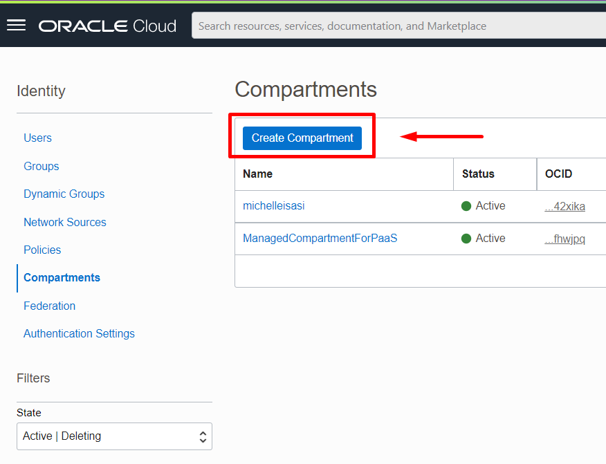
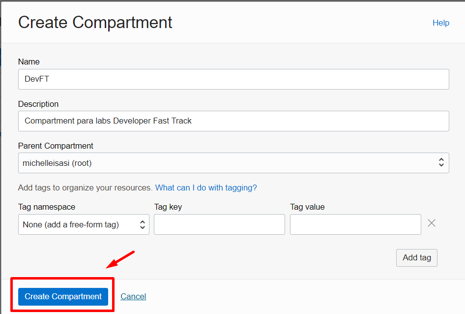
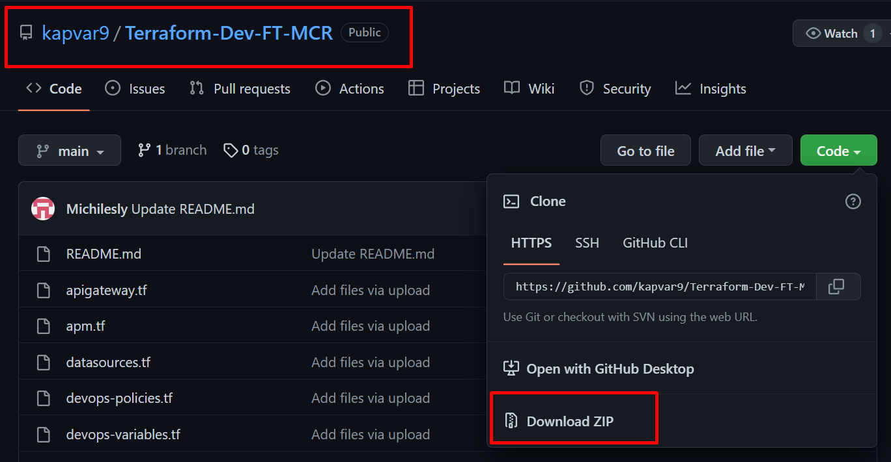
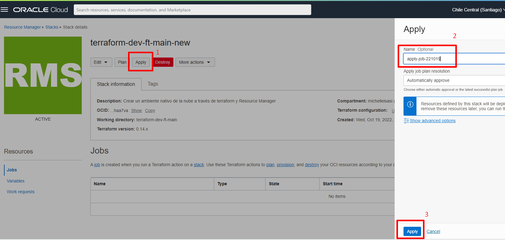

# Lab. 1 - Aprovisionamiento de recursos 

En esta etapa, se aprovisionará recursos dentro de OCI utilizando Terraform con el servicio **Resource Manager**!

- 🌀 [Página oficial de Resource Manager](https://www.oracle.com/pe/devops/resource-manager/)
- 🧾 [Documentaçión de Resource Manager](https://docs.oracle.com/en-us/iaas/Content/ResourceManager/home.htm)

Los recursos provisionados serán:
- OKE
- Artifact Registry
- Container Registry
- OCI DevOps
- APM
- API Gateway
- Streaming
- Object Storage
- Functions

Junto con recursos de red y administración como:
- VCN
- Subnets
- Dynamic Groups
- Policies
- Compartments

- - -

# Requisitos Previos - creación de compartimentos
Como requisito previo, es una buena idea crear un compartimento aislado para poder agrupar nuestros recursos.

1. Para hacer esto, inicie sesión o [login](https://www.oracle.com/cloud/sign-in.html) en su cuenta de OCI.
2. Desde el menú ☰ acceder: **Identity & Security** → **Identity** → **Compartments**.

3. En la nueva ventana, haga clic en Crear compartimento.
 

4. Introduzca un nombre para el compartimento y también una descripción. Una vez hecho esto, haga clic en **Crear compartimento**.
Ejemplo: 
   - ***Name:*** DevFT 
   - ***Description:*** Compartment para labs Developer Fast Track 

**¡¡¡Excelente!!!**  💯 ¡Ahora podemos comenzar con nuestros pasos de laboratorio!

- - -

## Paso 1 - Descarga el repositorio

Como primer paso, debemos descargar el archivo (zip) desde el repositorio de github.

1. Para hacer esto, vaya al [repositorio](https://github.com/kapvar9/Terraform-Dev-FT-MCR) y haga clic en **Descargar ZIP**.

- - -

## Paso 2: Cargar terraform en Resource Manager

1. Inicie sesión en [login](https://www.oracle.com/cloud/sign-in.html) en su cuenta de OCI.
2. Desde el menú ☰ acceder a: **Developer Services** → **Resource Manager** → **Stacks**.

3. En esta nueva ventana, acceda al compartimento creado anteriormente y haga clic en **Create Stack**.

4. Seleccione la opción "Zip file", haga clic en "browse" y arrastre el archivo (.zip), que contiene los archivos .tf. Resource Manager completará todos los campos por defecto.

5. Haga clic en **Next**, para que podamos configurar algunos parámetros sobre los recursos a provisionar.

6. En esta nueva pantalla, recuerda seleccionar el compartimento creado anteriormente y haz clic en **Mostrar opciones avanzadas**.

7. Antes de continuar, recuerda seleccionar la versión "v1.23.4" en la opción **Versión de Kubernetes**.

8. Haga clic en **Siguiente**.

9. Una vez creada nuestro stack, haga clic en **Apply** y confirme la acción.

10. El aprovisionamiento de recursos debería tomar alrededor de 25 minutos.

11. ¡Después de finalizar con éxito la aplicación, podemos verificar el aprovisionamiento de nuestros recursos!

### ✔ ¡¡¡Entornos aprovisionados con éxito!!! ¡Has aprovisionado recursos usando Terraform en OCI! 🚀

