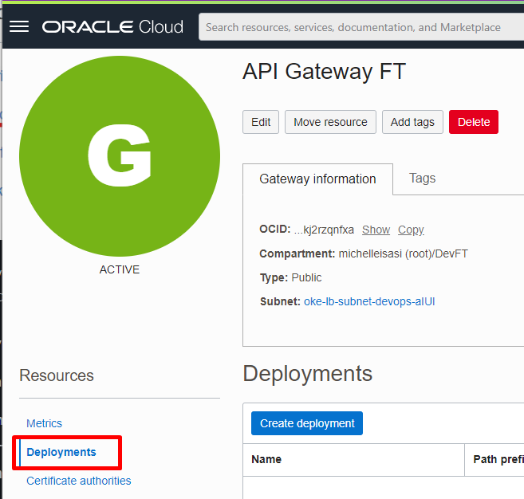

# Lab 2 - Developing Cloud Native Applications - Parte 1

Laboratorio para mostrar en la práctica como funcionan las herramientas para desarrolladores en OCI.

## Objetivo

Crear una aplicación en Kubernetes con imágenes de contenedor almacenadas en Oracle Container Registry (OCIR). El backend de la aplicación se expondrá a través de API Gateway, donde recibirá los encabezados CORS necesarios para comunicarse con el frontend.

Además, la aplicación ya contará con las librerías y configuraciones necesarias para ser monitoreada por el APM, lo cual se demostrará en el laboratorio 5.


- [Lab 2 - Developing Cloud Native Applications - Parte 1](#lab-2---developing-cloud-native-applications---parte-1)


  - [Objetivo](#objetivo)
  - [Recopilación de información](#recopilación-de-información)
    - [Tenancy Namespace](#tenancy-namespace)
    - [User OCID & Auth Token](#user-ocid--auth-token)
    - [Datos APM](#datos-de-apm)     
    - [Código de región](#código-de-región)
  - [Docker Login](#docker-login)
  - [Configurar Kubectl](#configurar-kubectl)
  - [Copiar Código](#copiar-código)
  - [Configurar e implementar el backend](#configurar-e-implementar-el-backend) 
    - [Docker Build](#docker-build)
    - [Docker Push](#docker-push)
    - [Creación Secret no Kubernetes](#creación-secret-no-kubernetes)
    - [Configurar manifiesto de Kubernetes](#configurar-manifiesto-de-kubernetes)
    - [Implementar Kubernetes](#implementar-kubernetes)
  - [Configuración API Gateway](#configuración-api-gateway)
    - [Despliegue](#despliegue)
  - [Configurar e implementar frontend](#configurar-e-implementar-frontend)
    - [Configuración del frontend](#configuración-del-frontend)
    - [Docker Build Front](#docker-build-front)
    - [Docker Push Front](#docker-push-front)
    - [Configurar manifiesto de Kubernetes](#configurar-manifiesto-de-kubernetes)
    - [Implementar Front de  Kubernetes](#implementar-front-de-kubernetes)
  - [Test de la aplicación](#test-de-la-aplicación)
 
### Recopilación de información

Vamos a recopilar algunos datos en la tenencia de OCI que se utilizarán durante todo el laboratorio, le recomendamos que lo anote en un bloc de notas para tenerlo siempre a mano de una manera fácil. Se recopilará la siguiente información:

 ```bash
Tenancy Namespace:
User Name:
Auth Token:
APM Endpoint:
Public Key:
Código de Región:
 ```
 
### Tenancy Namespace

Haga clic en el menú del lado derecho en el icono de usuario, haga clic en el nombre de su Tenancy.


Ahora copie el namespace en el bloc de notas.


### User OCID & Auth Token

Haga clic en el menú del lado derecho en el icono de usuario, haga clic en su nombre de usuario.


Copie el OCID del usuario y guárdelo en el bloc de notas.

Luego vaya a Auth Tokens y genere un nuevo token, guarde el código del token en el bloc de notas (Solo aparece 1 vez).


### Datos de APM

Navegue por el menú principal hasta Observability & Management > Application Monitoring> Administration

Haga clic en el dominio creado por Resource Manager en la práctica de laboratorio anterior y copie los datos de Endpoint y Public Key.


### Código de Región

Puede buscar su código de región [aquí](https://docs.oracle.com/en-us/iaas/Content/Registry/Concepts/registryprerequisites.htm#regional-availability)

## Docker Login

Necesitaremos Docker para construir los contenedores de aplicaciones y enviarlos a OCIR. Antes del impulso, debemos iniciar sesión en OCIR a través de dorcker-CLI.


Abra **Cloud Shell** y ejecute el siguiente comando reemplazando el nombre de usuario, el número de propietario y el código de región. Y en la contraseña use el Auth Token generado anteriormente.


```bash
docker login <Codigo Region>.ocir.io -u <namespace>/<username>

Example:  
docker login sa-santiago-1.ocir.io -u axlx12345/oracleidentitycloudservice/pepito@domain.com
```
Resultado:

```bash
password: <Auth Token>
WARNING! Your password will be stored unencrypted in /home/trial01oci/.docker/config.json.
Configure a credential helper to remove this warning. See
https://docs.docker.com/engine/reference/commandline/login/#credentials-store
```


## Configurar Kubectl

Ahora configuremos el acceso a Kubernetes a través de Kubectl en Cloud Shell, en el menú principal ir **Developer Services > Containers & Artifacts > Kubernetes Clusters (OKE)**.

Ingresar al clúster creado a través del Administrador de recursos y haga clic en el botón **Access Cluster**


Copie el comando que aparece en la ventana emergente y ejecútelo en el shell de la nube.

Ejemplo:

```bash
$ oci ce cluster create-kubeconfig --cluster-id ocid1.cluster.oc1.sa-saopaulo-1.aaaaaaaan2pf --file $HOME/.kube/config --region sa-saopaulo-1 --token-version 2.0.0  --kube-endpoint PUBLIC_ENDPOINT

**Resultado**
New config written to the Kubeconfig file /home/trial01oci/.kube/config

```

El acceso se puede probar con el siguiente comando:

```bash
kubectl get nodes
```
Deberías tener una respuesta similar a esta:

```bash
NAME           STATUS   ROLES   AGE     VERSION
10.20.10.125   Ready    node    3h23m   v1.21.5
10.20.10.138   Ready    node    3h23m   v1.21.5
10.20.10.208   Ready    node    3h23m   v1.21.5
```


## Copiar Código
Abra Cloud Shell y ejecute **git clone** el código de la aplicación:

```bash
git clone https://github.com/ChristoPedro/labcodeappdev.git 
```

**Resultado**


## Configurar e implementar el backend

Navegue la carpeta de back-end:

```bash
cd labcodeappdev/Backend/code
```

Vamos a revisar la imagen de back-end y luego enviémosla a OCIR.

### Docker Build

Ejecute el comando:

```bash
docker build -t <Codigo Region>.ocir.io/<tenancy-namespace>/ftdeveloper/back .
```


### Docker Push

Después de compilar, enviaremos a OCIR

```bash
docker push <Codigo Region>.ocir.io/<tenancy-namespace>/ftdeveloper/back
```


## Creación Secret no Kubernetes

Vamos a crear un secret que contendrá la información de inicio de sesión de OCIR. Permitiendo así la extracción de imágenes.

Simplemente ejecute este código, reemplazando los valores

```bash
kubectl create secret docker-registry ocisecret --docker-server=<region-key>.ocir.io --docker-username='<tenancy-namespace>/<oci-username>' --docker-password='<oci-auth-token>' --docker-email='<email-address>'
````

**Respuesta:**

```bash
secret/ocisecret created
```

### Configurar manifiesto de Kubernetes

Retrocedamos una carpeta ahora:

```bash
cd ..
```
Edite el código para agregar el APM y los parámetros de imagen:

```bash
vi Deploybackend.yaml
```
Pressione **i** para editar.

Substituir los valores de **Image-Name**, **Endpoint do APM** e **Key do APM** en las siguientes lineas:

*Tener en cuenta que los datos  a sustitur son los que se encuentran dentro de [], no ignorar las comillas "" *

```note
Image-Name = <Codigo Region>.ocir.io/<tenancy-namespace>/ftdeveloper/back
```

```yaml
      - name: backend
        image: [Image-Name]:latest
        imagePullPolicy: Always
        ports:
        - containerPort: 5000
        env:
        - name: APM_URL
          value: "[Substitua pelo Endpoint do APM]"
        - name: APM_KEY
          value: "[Substitua pela Public Key do APM]"
```
**Ejemplo**


Después de reemplazar los valores, use el siguiente comando **ESC: wq! ** y presione Enter.

### Implementar Kubernetes

Con el archivo editado, podemos ejecutar el siguiente comando para implementar:

```bash
kubectl apply -f Deploybackend.yaml
```

Debería tener un resultado como el siguiente:

```bash
deployment.apps/cepapp-backend created
service/cepapp-backend created
```

Podemos usar el siguiente código para saber si los **pods** ya están activos:

```bash
kubectl get pods
```
**Ejemplo**
Revisar que el **status** se encuentra en "Running"


## Configuración API Gateway

Primero necesitamos averiguar la IP del **Load Balancer** del servicio backend.

```bash
kubectl get svc cepapp-backend
```

El resultado se verá así:

```bash
NAME             TYPE           CLUSTER-IP      EXTERNAL-IP      PORT(S)          AGE
cepapp-backend   LoadBalancer   10.96.123.143   10.20.20.237     5000:31952/TCP   13m
```

Vamos a usar EXTERNAL-IP para exponerlo a través de **API Gateway**.

Ahora vayamos al menú principal **Developer Services > API Management > Gateways**. Y seleccione el *gateway* ya creado por Resource Manager. En el menú de la izquierda, vaya a  **Deploymets**.



Y ahora vamos a crear una nueva implementación, que contendrá la ruta de backend que será consumida por el frontend.

### Despliegue

Complete la información básica con los siguientes datos:

- **Name**: backend
- **PATH PREFIX**: /cep
- **Compartment**: Selecione su compartimiento (DevFT)


Ahora completemos la información de **CORS**, sin ella tendremos errores en las llamadas entre el Frontend y el Backend.

En la región CORS, haga clic en el botón Agregar y complete los siguientes campos:

- **ALLOWED ORIGINS**: *
- **Methods**: GET

Y aplicar los cambios.


Con CORS configurado, podemos hacer clic en **Next** y configurar la ruta. Completemos los campos de **Route1** de la siguiente manera:

- **PATH**: /getcep
- **METHODS**: GET
- **TYPE**: HTTP
- **URL**: ```http://[External-IP-do-LoadBalancer]:5000```


Una vez completado, haga clic en Siguiente y luego en Crear.

Cuando se complete la creación de la implementación, copie la **URL del endpoint** y pruebe la ruta.


Ingrese el EndPoint en el navegador, en el siguiente formato:

```bash
<seu_endpoint>/getcep?cep=<cep-da-sua-casa>

Ejemplo:
https://n3g5tuq12345.apigateway.sa-santiago-1.oci.customer-oci.com/cep + **/getcep?cep=<cep-da-sua-casa>**

**Resultado:**
https://n3g5tuq12345.apigateway.sa-santiago-1.oci.customer-oci.com/cep/getcep?cep=04710090

```


## Configurar e implementar frontend

Para Frontend, necesitamos reemplazar la URL del backend y la información de APM antes de construir Docker.

### Configuración del frontend

Naveguemos a la carpeta javascript:

```bash
cd $HOME/labcodeappdev/Frontend/code/js
```

Y edite el archivo **api.js**

```bash
vi api.js
```

Reemplacemos la variable url.

```js
const url = '[Substituia com a URL do API Gateway]'

```

Para eso, presione **i** para editar el archivo, reemplace la información dentro de las comillas.

```js
const url = 'https://ghstpnks2qut3htj2w7zmdtghi.apigateway.sa-saopaulo-1.oci.customer-oci.com/cep/getcep'
```

Para guardar use las teclas **ESC : wq!**.

Ahora necesitamos configurar APM en HTML, retrocedamos una carpeta:

```bash
cd ..
```

Y edite el archivo **index.html**:

```bash
vi index.html
```


Y reemplaza los valores en las siguientes líneas:


```html
<script>
  window.apmrum = (window.apmrum || {}); 
  window.apmrum.serviceName='CEP';
  window.apmrum.webApplication='cepapp';
  window.apmrum.ociDataUploadEndpoint='[Substitua com o Endpoint do APM]';
  window.apmrum.OracleAPMPublicDataKey='[Substitua com a Public Key do APM]';
</script>
<script async crossorigin="anonymous" src="[Substitua com o Endpoint do APM]/static/jslib/apmrum.min.js"></script>
```

Guarda el archivo.

### Docker Build Front

Después de configurar la interfaz, realizemos el **doker** con el siguiente comando.

```bash
docker build -t <Codigo Region>.ocir.io/<tenancy-namespace>/ftdeveloper/front .
```


### Docker Push Front

Al final de la compilación, podemos enviar a OCIR

```bash
docker push <Codigo Region>.ocir.io/<tenancy-namespace>/ftdeveloper/front
```


### Configurar manifiesto de Kubernetes

Ahora tenemos que retroceder una carpeta más:

```bash
cd ..
```

Y edite el archivo Deployfrontend.yaml:

```bash
vi Deployfrontend.yaml
```

 Presione **i** para editar el archivo y reemplace el **Image-Name**:

 ```note
Image-Name = <Codigo Region>.ocir.io/<tenancy-namespace>/ftdeveloper/front
```

 ```yaml
     spec:
      containers:
      - name: front
        image: [Image-Name]:latest
        imagePullPolicy: Always
        ports:
        - containerPort: 80
      imagePullSecrets:
```

Después del cambio guarde el archivo con **ESC : wq! **.

### Implementar Front de Kubernetes

Ahora ejecutemos la implementación de frontend en Kubernetes con el siguiente comando:


```bash
kubectl apply -f Deployfrontend.yaml
```

Resultado:

```bash
deployment.apps/cepapp-front created
service/cepapp-front created
```


## Test de la aplicación

Ahora, con la implementación de frontend y backend, podemos probar la aplicación.

Validar que se encuentren en STATUS **RUNNING** el backend y front

```bash
kubectl get all
```


Obtengamos la IP del Frontend Load Balancer para acceder a la aplicación:

```bash
kubectl get svc cepapp-front
```

Obteniendo un resultado similar a este:

```bash
NAME           TYPE           CLUSTER-IP     EXTERNAL-IP      PORT(S)        AGE
cepapp-front   LoadBalancer   10.96.188.10   152.70.213.248   80:31117/TCP   89s
```

Simplemente copie la IP externa en el navegador y pruebe si la aplicación devuelve la información.


COMPLETASTE EXITOSAMENTE EL LABORATORIO N#2 !! 💯✅


