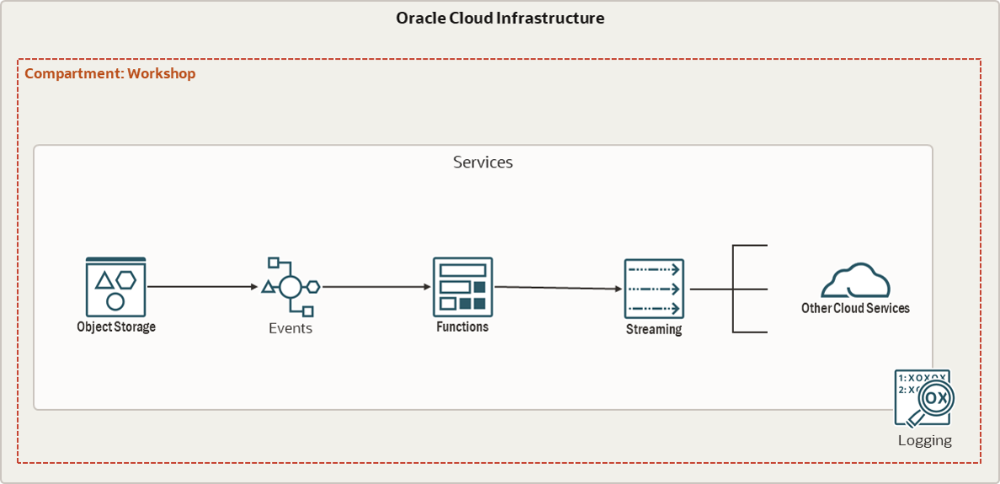

<h1>Lab. #3 - Developing Cloud Native Applications - Parte 2</h1>

    Este taller fue desarrollado con el objetivo de demostrar las funcionalidades de Oracle Cloud Infrastructure en escenarios donde es necesario orquestar tu infraestructura en base a Eventos. El objetivo final de este taller es la creación e implementación del siguiente flujo de eventos:

<ul>
    <li><a href="https://www.oracle.com/pe/cloud/cloud-native/functions/">Página oficial de Oracle Functions</a></li>
    <li><a href="https://docs.oracle.com/en-us/iaas/Content/Functions/Concepts/functionsoverview.htm">Documentacion de Oracle Functions</a></li>
    <li><a href="https://www.oracle.com/pe/cloud/cloud-native/events-service/">Página oficial de Oracle Events</a></li>
    <li><a href="https://docs.oracle.com/en-us/iaas/Content/Events/Concepts/eventsoverview.htm">Documentación de Oracle Events</a></li>
    <li><a href="https://www.oracle.com/pe/cloud/cloud-native/streaming/">Página oficial de Oracle Streaming</a></li>
    <li><a href="https://docs.oracle.com/en-us/iaas/Content/Streaming/Concepts/streamingoverview.htm">Documentación de Oracle Streaming</a></li>

</ul>
Accede a tus laboratorios de interés aquí 👇
<ul>
    <li><a href="https://github.com/kapvar9/Developer-Fast-Track-MCR/blob/main/Lab%203/Lab_3A_Funciones/README.md">Lab 3A - Funciones</a></li>
    <li><a href="https://github.com/kapvar9/Developer-Fast-Track-MCR/blob/main/Lab%203/Lab_3B_Eventos/README.md">Lab 3B - Eventos</a></li>
</ul>

